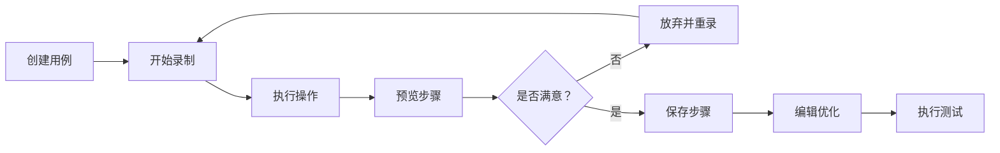

# 🎬 智能步骤录制器使用指南

## 功能概述

智能步骤录制器是 UI 自动化测试平台的核心增强功能，允许用户通过实际操作浏览器来自动生成测试步骤，与手动创建步骤形成完美闭环。

## 核心特性

### ✨ 主要功能
- **实时录制**: 用户在浏览器中的操作会实时被捕获并显示
- **智能识别**: 自动识别元素并生成最优定位器（CSS/XPath）
- **多操作支持**: 支持点击、输入、下拉选择等多种操作类型
- **实时预览**: 录制过程中可实时查看已生成的步骤
- **一键保存**: 录制完成后可一键保存到测试用例

### 🔧 技术特点
- **Playwright 驱动**: 基于 Playwright 实现高精度事件捕获
- **智能定位算法**: 优先生成可读性强的 CSS 选择器
- **异步处理**: 非阻塞式录制，不影响用户操作
- **会话管理**: 每个录制会话独立管理，互不干扰

## 使用流程

### 1️⃣ 开始录制

#### 步骤 1: 进入步骤管理页面
- 打开项目 → 选择测试用例 → 进入步骤管理页面

#### 步骤 2: 点击录制按钮
- 点击工具栏上的 **🎬 开始录制** 按钮

#### 步骤 3: 输入目标 URL
- 在弹出的录制面板中输入要测试的页面 URL
- 例如：`https://www.example.com/login`

#### 步骤 4: 启动录制
- 点击 **▶ 开始录制** 按钮
- 系统会自动打开浏览器并导航到指定页面

### 2️⃣ 执行操作

在打开的浏览器中进行正常操作，系统会自动记录：

#### ✅ 支持的操作类型

| 操作类型 | 说明 | 示例 |
|---------|------|------|
| 👆 点击 | 点击按钮、链接、图标等 | 点击登录按钮 |
| ⌨️ 输入 | 在文本框中输入内容 | 输入用户名 |
| 📋 选择 | 从下拉框中选择选项 | 选择城市 |

#### 💡 操作建议
- 操作节奏适中，不要过快
- 每次操作尽量明确，避免误触
- 复杂场景可以分多次录制

### 3️⃣ 实时预览

录制过程中，面板会实时显示：

```
┌─────────────────────────────────────┐
│ 📋 实时步骤预览                      │
├─────────────────────────────────────┤
│ 👆 步骤 1: 点击 #username            │
│    定位器：#username                 │
│                                     │
│ ⌨️ 步骤 2: 在 username 中输入：admin │
│    定位器：#username                 │
│    值：admin                         │
│                                     │
│ 👆 步骤 3: 点击 #password            │
│    定位器：#password                 │
└─────────────────────────────────────┘
```

### 4️⃣ 结束录制

#### 方式 1: 停止录制
- 点击 **⏹ 停止录制** 按钮
- 系统关闭浏览器并整理步骤

#### 方式 2: 直接保存
- 点击 **💾 保存步骤到用例** 按钮
- 步骤自动保存到当前用例并关闭录制面板

#### 方式 3: 放弃录制
- 点击 **放弃录制** 按钮
- 确认后可以丢弃所有录制的步骤

## 步骤格式说明

### 录制生成的步骤结构

```json
{
  "operation_type": "click",
  "operation_locator": "#submit-btn",
  "operation_value": "",
  "description": "点击按钮：提交",
  "sort_order": 1
}
```

### 操作类型映射

| 录制操作 | 平台步骤类型 | 说明 |
|---------|------------|------|
| click | click | 点击元素 |
| input | fill | 填充输入框 |
| select | select | 选择下拉项 |

### 定位器优先级

系统按以下优先级生成定位器：
1. **ID 选择器** (`#element-id`) - 最优先
2. **CSS 选择器** (`.class-name` 或 `tag.class`)
3. **XPath** (`//div[@id='xxx']`) - 最后选择

## 高级技巧

### 🎯 精准录制技巧

#### 1. 准备阶段
- 确保页面完全加载后再开始操作
- 关闭无关的浏览器标签页
- 保持网络稳定

#### 2. 操作阶段
- 点击操作要准确，避免点到子元素
- 输入操作要完整，避免中途停顿
- 选择操作要等待下拉框完全展开

#### 3. 调试阶段
- 录制完成后仔细检查每个步骤
- 删除不必要的操作步骤
- 调整步骤顺序使其更合理

### ⚡ 批量录制策略

#### 场景 1: 长流程测试
```
登录 → 搜索 → 筛选 → 详情 → 下单 → 支付
```
建议：分段录制，每 5-8 步保存一次

#### 场景 2: 数据驱动测试
```
录制一次操作流程 → 保存 → 修改输入数据 → 再次运行
```

#### 场景 3: 边界值测试
```
录制主流程 → 复制步骤 → 修改为边界值 → 保存为新用例
```

### 🔍 元素定位优化

#### 好的定位器特征
- ✅ 唯一性：能精确定位到目标元素
- ✅ 稳定性：不易受页面结构调整影响
- ✅ 可读性：见名知意，便于维护

#### 定位器示例对比

```css
❌ 不推荐：/html/body/div[1]/div[2]/form/input[3]
✅ 推荐：#login-form > .username-input

❌ 不推荐：.btn.btn-primary.btn-lg.mt-2
✅ 推荐：#submit-btn
```

## 常见问题

### Q1: 录制时浏览器没有打开？
**A:** 请检查：
- Playwright 是否正确安装
- 浏览器驱动是否可用
- 防火墙是否阻止了浏览器启动

### Q2: 录制的步骤无法执行？
**A:** 可能原因：
- 元素定位器不准确
- 页面加载时间不够
- 需要等待特定条件
- 建议在步骤编辑页面调整定位器或添加等待步骤

### Q3: 如何录制弹窗操作？
**A:** 目前支持：
- 原生浏览器弹窗（alert/confirm）
- 模态框（Modal）
- 自定义弹窗
- iframe 内操作（需特殊处理）

### Q4: 录制速度太快导致部分步骤丢失？
**A:** 建议：
- 放慢操作节奏
- 每个操作间隔 1-2 秒
- 重要操作可以适当停顿

### Q5: 如何录制文件上传？
**A:** 当前限制：
- 暂不支持文件选择对话框
- 建议：手动添加文件上传步骤
- 或使用输入框直接输入文件路径

## 最佳实践

### 📖 标准工作流程



### ✅ 推荐的录制习惯

1. **录制前规划**
   - 明确测试目标
   - 列出关键步骤
   - 准备测试数据

2. **录制中注意**
   - 操作清晰明确
   - 节奏适中均匀
   - 实时关注预览

3. **录制后检查**
   - 验证步骤完整性
   - 检查定位器准确性
   - 调整步骤顺序

### 🚀 提升效率的技巧

#### 技巧 1: 模板化录制
将常用操作流程录制成模板，后续复制修改使用

#### 技巧 2: 组合录制
将复杂流程拆分为多个子流程分别录制，最后组合

#### 技巧 3: 增量录制
先录制主流程，再逐步补充异常流程和边界情况

## 技术架构

### 系统架构图

```
┌─────────────────────────────────────────┐
│          前端（Vue/HTML）                │
│  - 录制控制面板                          │
│  - 实时步骤预览                          │
│  - 步骤编辑区                            │
└──────────────┬──────────────────────────┘
               │ HTTP/WebSocket
┌──────────────▼──────────────────────────┐
│         后端（Python + Flask）           │
│  - API 路由                              │
│  - 会话管理                              │
│  - 步骤转换                              │
└──────────────┬──────────────────────────┘
               │ Async/Await
┌──────────────▼──────────────────────────┐
│      录制引擎（Playwright）              │
│  - 浏览器控制                            │
│  - 事件捕获                              │
│  - 元素识别                              │
└──────────────┬──────────────────────────┘
               │
┌──────────────▼──────────────────────────┐
│          数据库（SQLite）                │
│  - 测试步骤存储                          │
└─────────────────────────────────────────┘
```

### 核心组件

#### 1. StepRecorder 类
```python
class StepRecorder:
    - start(): 启动浏览器并开始录制
    - stop(): 停止录制并关闭浏览器
    - handle_event(): 处理捕获的事件
    - _generate_step(): 生成步骤对象
```

#### 2. 事件监听器
```javascript
// 注入到页面的 JavaScript
document.addEventListener('click', ...)
document.addEventListener('input', ...)
document.addEventListener('change', ...)
```

#### 3. 智能定位器生成
```javascript
function getXPath(element) { ... }
function getCssSelector(element) { ... }
```

## API 参考

### 开始录制
```http
POST /api/steps/recording/start
Content-Type: application/json

{
  "url": "https://example.com",
  "case_id": 1,
  "project_id": 1
}
```

### 停止录制
```http
POST /api/steps/recording/stop
Content-Type: application/json

{
  "session_id": "recording_xxx"
}
```

### 获取录制步骤
```http
GET /api/steps/recording/steps?session_id=xxx
```

### 保存录制步骤
```http
POST /api/steps/recording/save
Content-Type: application/json

{
  "session_id": "recording_xxx",
  "case_id": 1
}
```

## 更新日志

### v1.0.0 (2026-03-30)
- ✅ 初始版本发布
- ✅ 支持点击、输入、选择操作
- ✅ 实时步骤预览
- ✅ 智能定位器生成
- ✅ 会话管理

## 未来计划

### 🎯 即将推出
- [ ] 支持 iframe 内操作录制
- [ ] 支持拖拽操作录制
- [ ] 支持键盘快捷键录制
- [ ] 步骤去重优化
- [ ] 录制过程回放

### 🔮 长期规划
- [ ] AI 辅助步骤优化
- [ ] 智能等待条件添加
- [ ] 录制路径可视化
- [ ] 多人协作录制
- [ ] 录制脚本导出

## 技术支持

如有问题或建议，请联系：
- 📧 Email: support@uatplatform.com
- 📱 平台在线客服
- 📖 完整文档：平台帮助中心

---

**祝您使用愉快！🎉**
