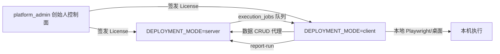

# Client / Server 部署架构

本文档描述 PC 端转型后的三层部署，与 [ARCHITECTURE_LOCAL.md](ARCHITECTURE_LOCAL.md)（单机一体）互补。

## 部署模式

| 模式 | 环境变量 | 说明 |
|------|----------|------|
| **standalone** | `DEPLOYMENT_MODE=standalone`（默认） | 现有行为：Flask + SQLite + 本机 Playwright/桌面自动化 |
| **server** | `DEPLOYMENT_MODE=server` | 团队数据服务器：项目/用例/历史集中存储；`/api/cases/<id>/run` 入队，由客户端执行 |
| **client** | `DEPLOYMENT_MODE=client` 或 `UAT_DESKTOP_MODE=1` | 桌面安装包：pywebview 壳 + 本机自动化；数据 API 代理到 `TEAM_SERVER_URL` |

## 架构



## 启动方式

### 团队服务器

```powershell
$env:DEPLOYMENT_MODE = "server"
python app.py
```

### 桌面客户端

```powershell
python packaging/uat_desktop.py
```

首次启动打开 `/client-setup`，配置团队服务器地址与账号。

### 创始人控制面

```powershell
$env:PLATFORM_ADMIN_USER = "founder"
$env:PLATFORM_ADMIN_PASSWORD = "your-password"
python projects/testory-platform-admin/app.py
```

默认端口 `5100`。功能：License 签发/吊销、安装包发布与下载统计、订单录入。

详见 [PROJECT_SPLIT.md](PROJECT_SPLIT.md)。

## 关键模块

| 文件 | 作用 |
|------|------|
| [deployment_config.py](../deployment_config.py) | 模式判断、是否隐藏支付 UI |
| [deployment_hooks.py](../deployment_hooks.py) | Flask 路由、代理、首次配置 |
| [execution_remote.py](../execution_remote.py) | 执行队列 claim/complete |
| [team_server_client.py](../team_server_client.py) | 客户端访问团队服务器 |
| [client_config_store.py](../client_config_store.py) | 本地保存服务器 URL、会话 |
| [projects/testory-platform-admin/](../projects/testory-platform-admin/) | 创始人后台 |

## License 双层

- **签发**：`generate_license.py` 或创始人控制面 `/licenses`
- **激活**：团队版在 **server** 绑定 `instance_id`；个人/桌面在 **client** 绑定 `machine_id`
- **字段**：`license_id`、`binding_type`、`binding_id`、`seat_count`（见 [license_manager.py](../license_manager.py)）

## 工作空间

- 表 `workspaces`（默认 id=1）替代 SaaS 多租户叙事
- 用户 `tenant_id` 仍兼容，语义为 `workspace_id`
- 协作仍以 `project_members` 为主

## 更新通道

- 客户端： [packaging/enterprise/update_*.py](../packaging/enterprise/) + 控制面 `releases` 下载追踪 URL
- 服务器：Docker / 传统部署，与 standalone 相同
