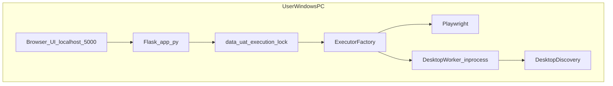

# 本地版混排自动化架构说明

本文档描述 **用户 Windows 本机** 运行 HuFirst UAT 平台时的推荐架构，与仓库内 Docker（仅 Web）部署区分。

## 架构图（16:9）

| 格式 | 路径 |
|------|------|
| 矢量源文件 | [architecture_local_16x9.svg](assets/architecture_local_16x9.svg) |
| PNG（1920×1080） | [architecture_local_16x9.png](assets/architecture_local_16x9.png) |

重新生成：`python scripts/generate_architecture_svg.py`  
重新导出 PNG：`pip install cairosvg` 后执行 `python scripts/render_architecture_png.py`

## 架构总览



| 模块 | 实现 | 说明 |
|------|------|------|
| 统一步骤 | `step_executor.py` + `execution_factory.py` | 按 `automation_layer` 分发 |
| Web 执行 | `playwright_automation.py` | 浏览器自动化 |
| 桌面执行 | `desktop_automation.py` | pywinauto，默认 **inprocess** |
| 零配置桌面 | `desktop_discovery.py` | 「选择当前窗口」、程序名解析 |
| 本机互斥 | `execution_lock.py` | `data/.uat_execution.lock` |
| 远程测试机 | `test_machines` + `/api/desktop/machines` | **local 配置下 API 返回 403** |

## 环境变量（本地版默认）

| 变量 | 本地默认 | 含义 |
|------|----------|------|
| `DEPLOYMENT_PROFILE` | `local` | 单机套件，不暴露远程机注册 |
| `DESKTOP_EXECUTION_MODE` | `inprocess` | 桌面步骤进程内执行，无额外 HTTP |
| `PLAYWRIGHT_HEADLESS` | `0`（建议） | 混排用例需有界面会话 |
| `DESKTOP_AUTO_START_GATEWAY` | `0` | 不自动拉起 `desktop_automation_gateway` |

### 桌面执行三档模式

| 模式 | 行为 | 适用 |
|------|------|------|
| `inprocess` | 直接 `DesktopWorker` | **本地版默认** |
| `gateway` | HTTP → 本机 `127.0.0.1:8766` 子进程 | 调试 pywinauto 崩溃隔离 |
| `remote` | HTTP → 远程 Agent URL | 仅 `DEPLOYMENT_PROFILE=enterprise` |

网关进程内执行步骤时 **强制 inprocess**，避免网关 HTTP 回调自身造成死循环。

## 资源锁定

同一台机器同一时间只允许 **一个** 用例运行、定时调度批量、或数据驱动任务占用自动化资源（文件锁 + Playwright 线程锁）。

并发第二次手动运行将收到 HTTP **409**，提示「本机已有自动化任务在执行」。

## 安装与启动

1. 安装 Python 依赖：`pip install -r requirements.txt`；Windows 桌面步骤另装 `requirements-windows.txt`。
2. 复制 `.env.example` → `.env`，本地版可保持默认 `DEPLOYMENT_PROFILE=local`。
3. 执行 `playwright install`（或 `playwright install chromium`）。
4. 运行 **`packaging/run_uat_local.ps1`**，或手动：

```powershell
$env:DEPLOYMENT_PROFILE = "local"
$env:DESKTOP_EXECUTION_MODE = "inprocess"
$env:PLAYWRIGHT_HEADLESS = "0"
python app.py
```

浏览器访问 `http://127.0.0.1:5000`。

## 限制与边界

- 桌面自动化 **不能** 在 Linux/Docker 无头环境执行；含桌面步骤的用例必须在 **Windows 交互式桌面** 运行。
- Docker Compose 部署仅适合 **纯 Web** 用例；混排用例请使用本机套件。
- 用例跨机器时窗口标题/路径可能不同，请在用例步骤中保存 `desktop_spec`（「选择当前窗口」），而非依赖全局 `.env`。
- 多台机器并行跑同一项目属于未来 **enterprise** 范围，不在本地版默认路径内。

## 可选：网关与 PyInstaller 壳

- 网关：`python -m desktop_automation_gateway`（`DESKTOP_EXECUTION_MODE=gateway` 时使用）。
- 打包草稿：`packaging/uat_platform.spec`（PyInstaller，仅启动器原型）。
- 托盘壳原型：`packaging/uat_tray_webview.py`（需 `pywebview`，可选）。
