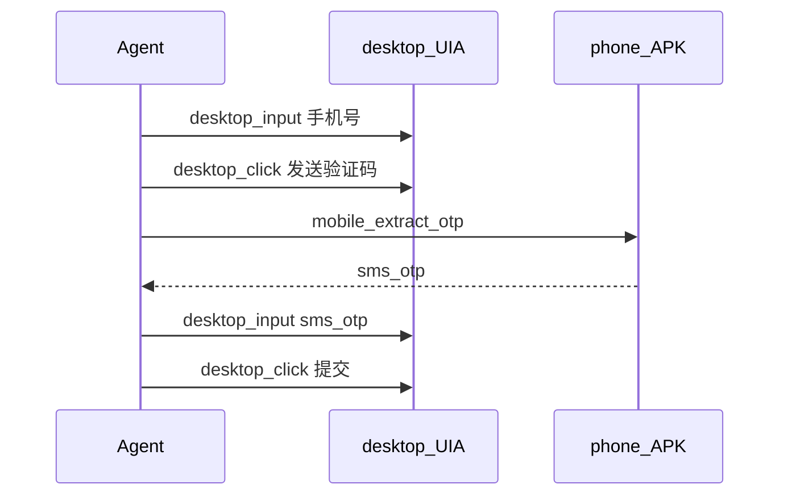

# 跨端 Agent 工具契约（大脑 / 双手）

> Testory 跨端 Agent：在 **PC 上思考**，通过工具驱动 **桌面 UIA / 浏览器 CDP / 手机本机 APK**，在一次任务中完成多端联动。

## 角色

| 角色 | 职责 |
|------|------|
| Agent（大脑） | 选工具、读返回、写共享变量、决定下一步 |
| 桌面执行器 | `desktop_*` / `windows_*` → 本机 UIA |
| 手机执行器 | `mobile_*` → sync enqueue → **手机 APK 本机执行** → await |
| 浏览器执行器 | Hermes / CDP（现有） |

正式路径：**禁止**用 adb 逐步遥控手机当执行引擎。

## 工具面

### 桌面（别名 → 现有 windows_*）

| 工具 | 说明 |
|------|------|
| `desktop_launch` | 启动应用 |
| `desktop_focus` | 聚焦窗口 |
| `desktop_click` | 短控件名点击 |
| `desktop_input` | 输入文本 |

### 手机（本机 await）

| 工具 | 说明 | 关键返回 |
|------|------|----------|
| `mobile_extract_otp` | 从通知/短信取验证码 | `variables.sms_otp` |
| `mobile_run_steps` | 下发步骤本机回放 | `job_id` + results + `variables` |
| `mobile_run_case` | 按 case_id 本机跑 | 同上 |

环境变量 `MOBILE_OTP_MOCK=123456`：无真机时立即返回 mock 码（CI）。

### 统一步骤 IR

动作与字段约定见 [`mobile_step_ir.md`](mobile_step_ir.md)。要点：

- 断言 / 截图 / 提取文本 / 等待出现在 **手机本机** 执行
- sync 推拉经 `mobile_spec` 透传 `assert_text`、`optional`、`max_retries` 等
- `solve_captcha`：手机截 ROI → `POST /api/mobile/sync/captcha/solve` → 本机手势；失败可 `human_gate`
- 变量 `{{name}}`；数据驱动优先 PC 展开，APK 支持用例 `dataRows`

### 共享 context

常用键：`phone_number`、`sms_otp`、`order_id`。跨端 stage 可用 `{{sms_otp}}` 引用。

---

## 验收剧本：桌面注册 + 手机取码 + 回填

文件：[demos/cross_end/desktop_mobile_otp_plan.json](../demos/cross_end/desktop_mobile_otp_plan.json)

变量约定：

| 阶段 | 写入 | 读取 |
|------|------|------|
| desktop_fill_phone | `phone_number`（可选） | — |
| mobile_extract_otp | `sms_otp` | — |
| desktop_submit_otp | — | `{{sms_otp}}` |

---

## 实现入口

- Python 工具实现：[`mobile_cross_end_tools.py`](../mobile_cross_end_tools.py)
- Agent 挂载：`ai_chat_tool_loop.chat_tool_schemas` / `dispatch_cross_end_tool`
- Job 队列：`mobile_sync_store.enqueue_run_job(..., job_kind=extract_otp|run_steps)`
- 手机拉取：`GET /api/mobile/sync/run/pending?job_kind=...`
- APK 轮询：`PcRunJobPoller` 依次拉 `extract_otp` → `run_steps`，本机执行后 `POST .../run/{job_id}/events`

## 闭环验收（可立即跑）

| # | 路径 | 期望 |
|---|------|------|
| 1 | 配对手机 → Agent `mobile_extract_otp` | 通知取码 → `variables.sms_otp` |
| 2 | Agent `mobile_run_steps`（2～3 步 TAP/ASSERT） | 手机离开 Testory 执行 → `success` + `results` |
| 3 | Agent `mobile_run_case` | 与 2 相同，步骤来自 PC 用例库 |
| 4 | 手机 UI 回放进行中时再下发 run_steps | 返回 `MOBILE_BUSY`，不卡死 await |
