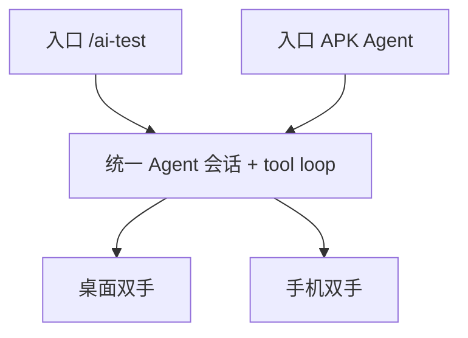

# 跨端 Agent：一脑多端双手

> **同一个 Agent**（PC 上推理 + 工具循环），入口可以是 `/ai-test` 或手机 APK 对话。  
> **双手** = 已连接的桌面 UIA / 手机本机 APK /（可选）浏览器。不按「PC Agent / 手机 Agent」拆两套大脑。

## 角色

| 角色 | 职责 |
|------|------|
| Agent（大脑） | 选工具、读返回、共享 `cross_end_vars`、决定下一步 |
| 桌面双手 | `desktop_*` / `windows_*` → 本机 UIA（桌面可用时挂载） |
| 手机双手 | `mobile_*` → sync enqueue → **APK 本机执行** → await（已配对时挂载） |
| 浏览器双手 | Hermes / CDP（可选） |

正式路径：**禁止**用 adb 逐步遥控手机当执行引擎。

## 工具面（按连接态裁剪）

| 工具 | 前提 | 关键返回 |
|------|------|----------|
| `desktop_*` | 桌面 preflight 通过 | 操作结果 |
| `mobile_extract_otp` | 用户已配对手机 | `variables.sms_otp` |
| `mobile_run_steps` / `mobile_run_case` | 同上 | results + variables |

`MOBILE_OTP_MOCK`：无真机干跑取码。

会话：[`agent_unified_session.py`](../agent_unified_session.py) — 同 `user_id`（及可选 `session_id`）跨入口共享变量。

## 验收（示例话术，非唯一）

前置：手机已配对；桌面目标可操作；PC 已绑定支持 tool calling 的模型。

1. **PC `/ai-test`** 或 **手机 Agent 模式** 任一侧说：登录某应用、手机号、取验证码并填写（表述可变）。  
2. 同一大脑编排桌面操作 + `mobile_extract_otp`；变量可跨入口复用。  
3. 失败如实报工具错误，不假装成功。

`/cross-end` 示例剧本仅演示，不是运行时模板。

## 实现入口

- 会话：`agent_unified_session.py`
- 工具循环：`ai_chat_tool_loop.run_unified_agent_blocking` / `run_ai_chat_with_tools_stream`
- 手机 API：`POST /api/mobile/sync/ai/generate`（`mode=agent` 默认）
- 双手执行：`mobile_cross_end_tools` + APK `PcRunJobPoller`
