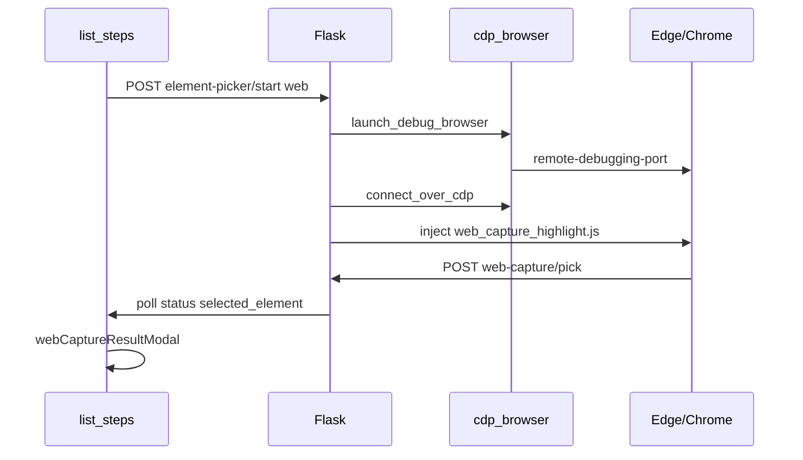

# 网页捕获设计说明

## 模块划分

```
web_capture/
  session.py           # 会话与模式路由
  cdp_browser.py       # 启动/连接 CDP
  cdp_picker.py        # 注入 highlight.js
  cdp_executor.py      # 运行时操作
  locator_generator.py # 定位候选
  validator.py         # test / verify
  extension_bridge.py  # WebSocket ↔ MV3
```

桌面模块 `desktop_*` 与网页模块无交叉 import。

## CDP 拾取序列



## 扩展 WebSocket 协议

| type | 方向 | 说明 |
|------|------|------|
| pick | ext → 平台 | `{ payload: dom pick }` |
| ping/pong | 双向 | 保活 |
| arm_picker | 平台 → ext | 在当前标签注入拾取 |

默认端口：`WEB_CAPTURE_EXT_WS_PORT`（19222）。

## 元素定义

见 `web_capture/element_definition.py`；保存步骤时扁平化为 `selector_type` / `selector_value` / `locator_candidates`。
